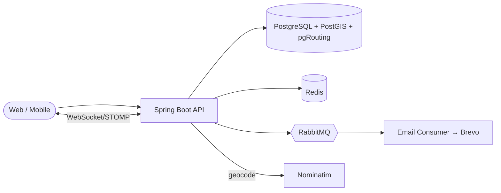

# 🍔 CraveX

A **multi-tenant food delivery SaaS** platform. Restaurants operate as isolated tenants, customers order and track deliveries in real time, and delivery agents are matched and routed using geospatial queries powered by **PostGIS** and **pgRouting**.

---

## 📑 Table of Contents

- [Features](#-features)
- [Tech Stack](#-tech-stack)
- [Architecture](#-architecture)
- [Geospatial Engine (PostGIS + Shortest Path)](#-geospatial-engine-postgis--shortest-path)
- [Getting Started](#-getting-started)
- [Roadmap](#-roadmap)
- [Author](#-author)

---

## ✨ Features

- **Multi-tenant RBAC** with `Restaurant.id` as the tenant boundary
- **Three-endpoint registration flow** with `PENDING_APPROVAL` states for roles that need approval
- **JWT authentication** with token blacklisting on logout
- **Redis-backed OTP** storage with TTL
- **Email notifications** via RabbitMQ + Brevo SMTP
- **Real-time order tracking** over WebSocket/STOMP
- **📍 Geospatial features (PostGIS):**
  - Geocoding of restaurant and customer addresses
  - Nearby-restaurant search using radius queries
  - Distance calculation for customer ↔ restaurant, restaurant ↔ agent, agent ↔ customer
  - **Shortest-path routing** for delivery agents over the road network

---

## 🛠 Tech Stack

| Layer | Technology |
|---|---|
| Language / Framework | Java 21, Spring Boot |
| Security | Spring Security, JWT |
| Persistence | Hibernate (JPA), **PostgreSQL 16 + PostGIS + pgRouting** |
| Caching | Redis 7 |
| Messaging | RabbitMQ 3.13 |
| Email | Brevo SMTP |
| Real-time | WebSocket / STOMP |
| Geocoding | OpenStreetMap Nominatim |
| Infra | Docker, Docker Compose |

---

## 🏗 Architecture



---

## 📍 Geospatial Engine (PostGIS + Shortest Path)

### 1. Enable extensions

```sql
CREATE EXTENSION IF NOT EXISTS postgis;
CREATE EXTENSION IF NOT EXISTS pgrouting;
```

### 2. Store locations as `geography`

Addresses are geocoded through Nominatim, then saved as WGS84 points.

```sql
ALTER TABLE restaurant
    ADD COLUMN location geography(Point, 4326);

CREATE INDEX idx_restaurant_location
    ON restaurant USING GIST (location);
```

In Java, this maps to a JTS `Point` using `hibernate-spatial`.

### 3. Nearby restaurants (radius search)

```sql
SELECT id, name,
       ST_Distance(location, ST_SetSRID(ST_MakePoint(:lng, :lat), 4326)::geography) AS distance_m
FROM restaurant
WHERE ST_DWithin(location,
                 ST_SetSRID(ST_MakePoint(:lng, :lat), 4326)::geography,
                 :radiusMeters)
ORDER BY distance_m;
```

`ST_DWithin` uses the GiST index, so it stays fast as the restaurant count grows.

### 4. Shortest path (Dijkstra with pgRouting)

The road network is imported from OpenStreetMap data (for example with `osm2pgrouting`), which creates the `ways` and `ways_vertices_pgr` tables.

**Step 1: snap a coordinate to the nearest road node**

```sql
SELECT id
FROM ways_vertices_pgr
ORDER BY the_geom <-> ST_SetSRID(ST_MakePoint(:lng, :lat), 4326)
LIMIT 1;
```

**Step 2: run Dijkstra between two nodes**

```sql
SELECT seq, node, edge, cost, agg_cost
FROM pgr_dijkstra(
    'SELECT gid AS id, source, target,
            length_m AS cost, length_m AS reverse_cost
     FROM ways',
    :sourceNode,
    :targetNode,
    directed := true
);
```

`agg_cost` on the last row is the total route distance in meters. The same query, with a travel-time column as `cost`, gives a delivery ETA.

### Where routing is used

| Leg | Purpose |
|---|---|
| Customer ↔ Restaurant | Delivery fee and restaurant ranking |
| Restaurant ↔ Agent | Pick the closest available agent |
| Agent ↔ Customer | Live delivery route and ETA |

---

## 🚀 Getting Started

### Prerequisites

- JDK 21
- Maven
- Docker and Docker Compose

### Run

```bash
# 1. Clone
git clone https://github.com/<your-username>/cravex.git
cd cravex

# 2. Start PostgreSQL (PostGIS + pgRouting), Redis, RabbitMQ
docker compose up -d

# 3. Configure environment (DB, Redis, RabbitMQ, JWT secret, Brevo key)
cp .env.example .env

# 4. Run the app
./mvnw spring-boot:run
```

### Docker Compose (database service)

```yaml
services:
  postgres:
    image: postgis/postgis:16-3.4  # PostgreSQL 16 + PostGIS + pgRouting, pin to a tag from Docker Hub
    environment:
      POSTGRES_DB: cravex
      POSTGRES_USER: cravex
      POSTGRES_PASSWORD: ${DB_PASSWORD}
    ports:
      - "5432:5432"
    volumes:
      - pgdata:/var/lib/postgresql/data

volumes:
  pgdata:
```

---

## 🗺 Roadmap

- [x] Multi-tenant RBAC and registration flow
- [x] JWT auth with blacklisting, Redis OTP
- [x] Email notifications (RabbitMQ + Brevo)
- [x] PostGIS integration (geography columns, GiST index, radius search)
- [x] Shortest-path calculation with pgRouting
- [ ] Live agent location streaming over STOMP
- [ ] Route polyline rendering on the frontend
- [ ] Traffic-aware ETA

---

## 👤 Author

**Shreemansu**
Aspiring Java Backend Developer · Bhubaneswar, Odisha, India

[GitHub](https://github.com/<your-username>) · [LinkedIn](https://linkedin.com/in/<your-handle>)
